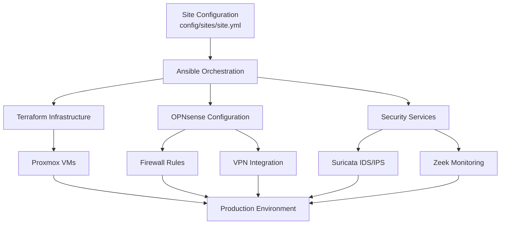

<div align="center">

# 🔥 Proxmox Firewall

**Enterprise-grade firewall infrastructure with automated deployment**

[](https://opensource.org/licenses/MIT)
[](#testing--validation)
[](https://www.ansible.com/)
[](https://www.terraform.io/)
[](https://www.python.org/)

**[Documentation](#-documentation) • [Quick Start](#-quick-start) • [Architecture](#-architecture) • [Features](#-features)**

</div>

---

## 🚀 Quick Start (Recommended: Template + Submodules)

> **This project is designed to be used as a submodule in your own infrastructure repo. Start from the [proxmox-firewall-template](https://github.com/FyberLabs/proxmox-firewall-template) for best results.**

### Prerequisites

- Ubuntu 20.04+ or similar Linux distribution
- 8GB+ RAM, 50GB+ storage for development
- Network access for downloading images

### 1. Fork and Clone the Template Repo

```bash
# Fork the template repo to your GitHub account
# Then clone your fork:
git clone https://github.com/YOUR-USERNAME/proxmox-firewall-template.git my-infra-project
cd my-infra-project

# Initialize submodules (including proxmox-firewall)
git submodule update --init --recursive
```

### 2. Configure Your Project

- Place your site configuration, secrets, and inventory in the `config/` directory of your parent repo.
- Edit `.env` with your environment variables and credentials.
- Add or update additional submodules (e.g., NAS, K8s, VPN) as needed.

### 3. Install Dependencies

```bash
./vendor/proxmox-firewall/deployment/scripts/prerequisites.sh
```

### 4. Create Site Configuration

```bash
./vendor/proxmox-firewall/deployment/scripts/create_site_config.sh
./vendor/proxmox-firewall/validate-config.sh <site_name>
```

### 5. Deploy Infrastructure

- **Testing/CI Environment:**

  ```bash
  ansible-playbook vendor/proxmox-firewall/deployment/ansible/master_playbook.yml --limit=<site_name>
  ```

- **Production Environment:**

  ```bash
  cd vendor/proxmox-firewall/proxmox-local/ansible
  ansible-playbook site.yml --limit=<site_name>
  ```

---

## 🧩 Submodule Workflow & Best Practices

- **All your config and secrets stay in your repo** (never in the submodule)
- **Update submodules** for new features/fixes as needed
- **Run scripts from the submodule, passing your config**
- See [docs/SUBMODULE_STRATEGY.md](docs/SUBMODULE_STRATEGY.md) for advanced usage

---

## 📖 Detailed Installation Guide (Submodule Workflow)

> **All steps below assume you are using the template repo and proxmox-firewall as a submodule in `vendor/proxmox-firewall/`.**

### 0. Environment Variables

```bash
cp env.example .env
```

Edit the `.env` file in your parent repo to set variables for the custom proxmox iso and variables for ansible.

### 1. Install Prerequisites

```bash
./vendor/proxmox-firewall/deployment/scripts/prerequisites.sh
```

### 2. Download Latest Images

```bash
./vendor/proxmox-firewall/deployment/scripts/download_latest_images.sh
```

### 3. Configure Sites

```bash
./vendor/proxmox-firewall/deployment/scripts/create_site_config.sh
```

This script will:

- Ask for site details (name, network prefix, domain, Proxmox host)
- Create external site configuration files (`config/<site_name>.conf`)
- Create minimal Ansible orchestration settings (`ansible/group_vars/<site_name>.yml`)
- Update `.env` file with environment variables for Terraform
- No `.tfvars` files are generated - everything uses environment variables

### 4. Configure Devices

```bash
./vendor/proxmox-firewall/deployment/scripts/add_device.sh
```

This script will:

- Help you select device templates
- Configure device settings
- Set up DHCP reservations
- Update firewall rules
- **Create or update device configuration files in `config/devices/<site_name>/` as needed**

**Alternatively, you can manually add device entries directly to your site YAML file (`config/sites/<site_name>.yml`).** This is useful for advanced users, bulk editing, or when you want full control over the device configuration format.

- See [README_DEVICES.md](README_DEVICES.md) for detailed device format, examples, and advanced options for both script-based and manual editing.

> **Tip:** Use the script for ease and guided setup, or edit the YAML directly for advanced scenarios or automation.

### 5. Customize Site and Device Configurations

- Edit site configurations in `config/sites/<site_name>.yml`
- Modify device configurations in `config/devices/<site_name>/`
- Update `.env` file with credentials and MAC addresses

```bash
# Validate your configuration before deployment
./vendor/proxmox-firewall/validate-config.sh <site_name>
```

### 6. Create Custom Proxmox ISO

```bash
ansible-playbook vendor/proxmox-firewall/deployment/ansible/playbooks/create_proxmox_iso.yml
```

This playbook will:

- Generate a custom Proxmox ISO with site/firewall specific answer files
- Optionally include hardware-specific configurations

### 7. Deploy Proxmox

```bash
sudo dd if=proxmox-custom.iso of=/dev/sdX bs=4M status=progress conv=fsync

# Install Proxmox on your hardware
# - Boot from USB
# - Installation will proceed automatically
# - Server will reboot when complete
```

### 8. Fetch Credentials

The `common/scripts/fetch_credentials.sh` script is used to retrieve and store credentials after deployment:

```bash
# Fetch credentials for a specific site (run after Proxmox deployment)
./vendor/proxmox-firewall/common/scripts/fetch_credentials.sh <site_name>
```

This will:

- Retrieve API tokens and keys from deployed systems
- Store them securely in the credentials directory
- Update the .env file with the retrieved values

### 9. Deploy Infrastructure and Configuration

**For CI/Testing and Initial Validation:**

```bash
# Validate configuration and run tests
./vendor/proxmox-firewall/validate-config.sh <site_name>

# Deploy basic infrastructure for testing
ansible-playbook vendor/proxmox-firewall/deployment/ansible/master_playbook.yml --limit=<site_name>
```

**For Production Deployment (run remotely first time):**

```bash
# Complete production deployment with OPNsense configuration
cd vendor/proxmox-firewall/proxmox-local/ansible
ansible-playbook site.yml --limit=<site_name>

# Or for maintenance (can be run locally on Proxmox server)
ansible-playbook site.yml --tags maintenance
```

The production deployment process:

- Loads site configuration from `config/sites/<site_name>.yml`
- Validates required environment variables from site config
- Provisions VMs using Terraform (OPNsense, Tailscale, Zeek, etc.)
- Configures OPNsense firewall with site-specific rules
- Sets up Tailscale VPN integration
- Deploys Suricata IDS/IPS and Zeek monitoring
- Configures automated backups and maintenance
- Provides comprehensive deployment status report

---

## ⚙️ Configuration Architecture

This site yaml shows a **inline single-file approach** for devices (add_device.sh is recommended see [README_DEVICES](README_DEVICES.md)):

### Site Configuration Example (`config/sites/<site_name>.yml`)

```yaml
site:
  name: "primary"
  display_name: "Primary Home"
  network_prefix: "10.1"
  domain: "primary.local"
  
  hardware:
    network:
      vlans:
        - id: 10
          name: "main"
          subnet: "10.1.10.0/24"
        - id: 20
          name: "cameras"
          subnet: "10.1.20.0/24"
  
  proxmox:
    host: "192.168.1.100"
    node_name: "pve"
    
  vm_templates:
    opnsense:
      enabled: true
      cores: 4
      memory: 4096
    tailscale:
      enabled: true
    zeek:
      enabled: true
      
  security:
    firewall:
      default_policy: "deny"
    suricata:
      enabled: true
      
  backup:
    enabled: true
    schedule: "0 2 * * *"
    retention: 7
      
  credentials:
    proxmox_api_secret: "PRIMARY_PROXMOX_API_SECRET"
    tailscale_auth_key: "TAILSCALE_AUTH_KEY"

devices:
  nas:
    ip_address: "10.1.10.100"
    vlan_id: 10
  camera_nvr:
    ip_address: "10.1.20.2"
    vlan_id: 20
```

### Environment Variables (`.env`)

```bash
# Global settings
TAILSCALE_AUTH_KEY="your_tailscale_auth_key"

# Site-specific credentials
PRIMARY_PROXMOX_API_SECRET="your_proxmox_api_secret"
```

### 🔒 Security Audit

Before deploying or contributing, run the security audit script to ensure no sensitive data is accidentally committed:

```bash
./common/scripts/security_audit.sh
```

This script checks for:

- Comprehensive `.gitignore` patterns
- Accidentally committed sensitive files  
- Proper environment variable configuration
- SSH key permissions
- Hardcoded secrets in configuration files

### 🏠 Local Management (Post-Deployment)

After initial deployment, set up automated local management on your Proxmox server:

```bash
# Run on Proxmox server to enable automatic updates from your fork
./common/scripts/setup_local_management.sh https://github.com/YOUR_USERNAME/proxmox-firewall.git primary
```

This enables:

- **🔄 Automatic updates** from your GitHub fork (every 15 minutes)
- **🏗️ Local Terraform state** management
- **📋 Continuous monitoring** and status reporting
- **🔒 Secure operation** with all secrets remaining local

See [Local Management Documentation](docs/LOCAL_MANAGEMENT.md) for details.

## 🔧 Key Benefits

- **🏗️ Infrastructure as Code**: Complete automation with Ansible and Terraform
- **🔒 Security First**: Multi-layered security with comprehensive monitoring
- **📱 Modern Management**: Web-based dashboards and API access
- **⚡ Performance**: Optimized for high-throughput networking
- **🛡️ Reliability**: Automated backups, health checks, and failover
- **📊 Visibility**: Comprehensive logging and network analysis
- **🌐 Scalability**: Easy multi-site deployment and management

## 🤝 Contributing

We welcome contributions! Please see our [Contributing Guide](CONTRIBUTING.md) for detailed information on:

- Development environment setup
- Code style guidelines  
- Pull request process
- Documentation standards
- Testing requirements

Quick contribution steps:

1. Fork the repository (for code contributions only)
2. Create a feature branch
3. Run tests: `./validate-config.sh`
4. Submit a pull request to the main repo

---

## 🕰️ Legacy: Manual Forking (Single-Site/Quick Start)

> **This section is for users who want a quick, single-site deployment and do not plan to scale or integrate with other infrastructure.**

### Manual Forking Steps

1. **Fork this repository** to your GitHub account (click "Fork" button above)

2. **Clone your fork**:

   ```bash
   git clone https://github.com/YOUR-USERNAME/proxmox-firewall.git
   cd proxmox-firewall
   ```

3. **Run the setup script** to customize all URLs for your fork:

   ```bash
   ./scripts/setup-fork.sh YOUR-USERNAME
   ```

4. **Continue with the rest of the setup as described above, but note that this approach is not recommended for multi-site, multi-component, or GitOps workflows.**

> **For detailed development and testing installation instructions (not for production), see [docs/DEVELOPMENT_INSTALL.md](docs/DEVELOPMENT_INSTALL.md).**

## 🚀 Overview

A comprehensive [Proxmox](https://pve.proxmox.com/wiki/Installation)-based firewall solution featuring **OPNsense**, **Tailscale VPN**, **Omada Controller**, and **Suricata IDS/IPS**. Designed for multi-site deployments with automated provisioning, advanced security monitoring, and enterprise-grade networking capabilities.

### 🎯 Key Features

- **🔐 Multi-layered Security**: OPNsense firewall + Suricata IDS/IPS + Zeek network monitoring
- **🌐 Multi-site VPN**: Tailscale mesh networking with subnet routing
- **⚡ Automated Deployment**: Complete infrastructure-as-code with Ansible & Terraform
- **📊 Advanced Monitoring**: Network traffic analysis, threat detection, and security dashboards
- **🔄 WAN Failover**: Automatic failover between fiber and satellite connections
- **🏠 Device Management**: Automated DHCP, VLAN isolation, and firewall rules
- **💾 Backup & Recovery**: Automated backups with configurable retention
- **🔧 Configuration Management**: Single YAML file per site with comprehensive validation

## 📋 Hardware Recommendations

| Component | Specification | Notes |
|-----------|---------------|-------|
| **CPU** | N100 to N355 | Low power, high efficiency |
| **Memory** | 8GB-32GB | 16GB+ recommended for monitoring |
| **Storage** | 128-512GB SSD | + CEPH or NAS for backups |
| **Network** | 3-8x I226v 2.5GbE | Multiple interfaces for VLANs |
| **Uplink** | 1-2x SFP+ 10GbE | Optional, ideal for high throughput |

## 📚 Documentation

| Document | Description |
|----------|-------------|
| **[📚 Complete Documentation](docs/README.md)** | Full documentation index and guides |
| **[🚀 Quick Start Guide](#-quick-start)** | Get up and running in minutes |
| **[🔧 Deployment Guide](deployment/README.md)** | Complete deployment automation |
| **[⚙️ Site Configuration](proxmox-local/ansible/SITE_CONFIG.md)** | Site-specific configuration management |
| **[🌐 Multi-site Setup](README_MULTISITE.md)** | Managing multiple locations |
| **[🏠 Device Management](README_DEVICES.md)** | Network device configuration |
| **[📡 Network Configuration](config/NETWORK_PREFIX_FORMAT.md)** | VLAN and network design |
| **[🔐 Security Policy](SECURITY.md)** | Security practices and vulnerability reporting |
| **[🛠️ Troubleshooting](docs/TROUBLESHOOTING.md)** | Common issues and solutions |
| **[🔌 API Documentation](docs/API.md)** | API reference for automation |
| **[🧪 Testing Framework](tests/README.md)** | Automated testing and validation |
| **[🐳 Docker Test Environment](docker-test-framework/QUICK_START.md)** | Local development and testing |
| **[🤝 Contributing Guide](CONTRIBUTING.md)** | How to contribute to the project |
| **[📋 Changelog](CHANGELOG.md)** | Release notes and changes |
| **[📝 TODO](TODO.md)** | Planned features and improvements |

## 🧪 Testing & Validation

The project includes comprehensive testing to ensure reliability:

- **✅ Configuration Validation**: Automated YAML syntax and structure validation
- **✅ Integration Tests**: End-to-end deployment testing with mock services
- **✅ Security Tests**: Firewall rules, VPN connectivity, and IDS/IPS validation
- **✅ Network Tests**: VLAN isolation, connectivity, and routing verification
- **✅ Service Health**: Automated monitoring of all deployed services

```bash
# Run comprehensive validation
./validate-config.sh

# Run integration tests
cd docker-test-framework && docker-compose up --build test
```

## 🏗️ Architecture



### Configuration Flow

```text
Single YAML File → Ansible (Direct Read) → Terraform (Environment Variables)
       ↓                    ↓                        ↓
config/sites/site.yml   Direct Processing      TF_VAR_* environment
```

## 🚀 Fork based deployment (only for development or testing)

### 1. Fork and Clone Your Repository

```bash
# First: Fork this repository on GitHub to YOUR-USERNAME/proxmox-firewall
# Then clone YOUR fork (not the original):
git clone https://github.com/YOUR-USERNAME/proxmox-firewall.git
cd proxmox-firewall

# Set up your fork with correct URLs:
./scripts/setup-fork.sh YOUR-USERNAME

# Configure environment:
cp env.example .env
# Edit .env with your configuration
```

### 2. Install Dependencies

```bash
./deployment/scripts/prerequisites.sh
```

### 3. Create Site Configuration

```bash
./deployment/scripts/create_site_config.sh
./validate-config.sh <site_name>
```

### 4. Deploy (Choose One)

**Testing/CI Environment:**

```bash
ansible-playbook deployment/ansible/master_playbook.yml --limit=<site_name>
```

**Production Environment:**

```bash
cd proxmox-local/ansible
ansible-playbook site.yml --limit=<site_name>
```

## 🧩 Using as a Submodule (Recommended for Integrators)

> **This repository is designed to be included as a submodule in your own infrastructure project.**

For most users, forking this repo is sufficient. For advanced users or integrators managing multiple sites or custom infrastructure, we recommend using this repo as a submodule in your own project, keeping all your configuration and secrets in your parent repo.

### Official Project Template

- See the [proxmox-firewall-template](https://github.com/FyberLabs/proxmox-firewall-template) (coming soon) for a ready-to-fork project structure with this repo as a submodule and example config.

### Recommended Structure

```text
my-firewall-project/
├── config/                # Your site-specific configuration, secrets, inventory, etc.
├── vendor/
│   └── proxmox-firewall/  # This repo as a submodule
├── .env                   # Your environment variables
└── ...
```

### Workflow

- **All your config and secrets stay in your repo**
- **This repo provides all code, scripts, and automation**
- **Update the submodule for new features/fixes**
- **Run scripts from the submodule, passing your config**

### Script Compatibility

- All scripts/tools support both local config and parent-repo config when used as a submodule.
- See [docs/SUBMODULE_STRATEGY.md](docs/SUBMODULE_STRATEGY.md) for discussion on submodule GitOps and best practices.

> **For detailed instructions on managing and deploying multiple sites, see [README_MULTISITE.md](README_MULTISITE.md).**
