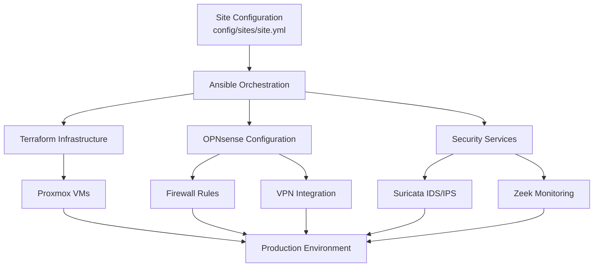

<div align="center">

# 🔥 Proxmox Firewall

**Enterprise-grade firewall infrastructure with automated deployment**

[](https://opensource.org/licenses/MIT)
[](#testing--validation)
[](https://www.ansible.com/)
[](https://www.terraform.io/)
[](https://www.python.org/)

**[Documentation](#-documentation) • [Quick Start](#-quick-start) • [Architecture](#-architecture) • [Features](#-features)**

</div>

---

## 🍴 **IMPORTANT: Fork This Repository First!**

> **⚠️ This is an Infrastructure-as-Code project designed for you to fork and customize for your own infrastructure.**

### 🚀 **For New Users:**

1. **🍴 Fork this repository** to your GitHub account (click "Fork" button above)
2. **📥 Clone your fork** (not this original repository):
   ```bash
   git clone https://github.com/YOUR-USERNAME/proxmox-firewall.git
   cd proxmox-firewall
   ```
3. **🔧 Run the setup script** to customize all URLs for your fork:
   ```bash
   ./scripts/setup-fork.sh YOUR-USERNAME
   ```
4. **⚙️ Configure your sites** and deploy your infrastructure

### 🎯 **Why Fork?**
- **🔒 Keep your infrastructure private** - Your configurations, credentials, and customizations stay in your fork
- **🔄 Get updates easily** - Pull improvements from upstream while maintaining your customizations  
- **🛡️ Security best practice** - Never store sensitive infrastructure data in public repositories
- **🤝 Contribute back** - Submit improvements via pull requests to help the community

---

## 🚀 Overview

A comprehensive [Proxmox](https://pve.proxmox.com/wiki/Installation)-based firewall solution featuring **OPNsense**, **Tailscale VPN**, **Omada Controller**, and **Suricata IDS/IPS**. Designed for multi-site deployments with automated provisioning, advanced security monitoring, and enterprise-grade networking capabilities.

### 🎯 Key Features

- **🔐 Multi-layered Security**: OPNsense firewall + Suricata IDS/IPS + Zeek network monitoring
- **🌐 Multi-site VPN**: Tailscale mesh networking with subnet routing
- **⚡ Automated Deployment**: Complete infrastructure-as-code with Ansible & Terraform
- **📊 Advanced Monitoring**: Network traffic analysis, threat detection, and security dashboards
- **🔄 WAN Failover**: Automatic failover between fiber and satellite connections
- **🏠 Device Management**: Automated DHCP, VLAN isolation, and firewall rules
- **💾 Backup & Recovery**: Automated backups with configurable retention
- **🔧 Configuration Management**: Single YAML file per site with comprehensive validation

## 📋 Hardware Recommendations

| Component | Specification | Notes |
|-----------|---------------|-------|
| **CPU** | N100 to N355 | Low power, high efficiency |
| **Memory** | 8GB-32GB | 16GB+ recommended for monitoring |
| **Storage** | 128-512GB SSD | + CEPH or NAS for backups |
| **Network** | 3-8x I226v 2.5GbE | Multiple interfaces for VLANs |
| **Uplink** | 1-2x SFP+ 10GbE | Optional, ideal for high throughput |

## 📚 Documentation

| Document | Description |
|----------|-------------|
| **[📚 Complete Documentation](docs/README.md)** | Full documentation index and guides |
| **[🚀 Quick Start Guide](#-quick-start)** | Get up and running in minutes |
| **[🔧 Deployment Guide](deployment/README.md)** | Complete deployment automation |
| **[⚙️ Site Configuration](proxmox-local/ansible/SITE_CONFIG.md)** | Site-specific configuration management |
| **[🌐 Multi-site Setup](README_MULTISITE.md)** | Managing multiple locations |
| **[🏠 Device Management](README_DEVICES.md)** | Network device configuration |
| **[📡 Network Configuration](config/NETWORK_PREFIX_FORMAT.md)** | VLAN and network design |
| **[🔐 Security Policy](SECURITY.md)** | Security practices and vulnerability reporting |
| **[🛠️ Troubleshooting](docs/TROUBLESHOOTING.md)** | Common issues and solutions |
| **[🔌 API Documentation](docs/API.md)** | API reference for automation |
| **[🧪 Testing Framework](tests/README.md)** | Automated testing and validation |
| **[🐳 Docker Test Environment](docker-test-framework/QUICK_START.md)** | Local development and testing |
| **[🤝 Contributing Guide](CONTRIBUTING.md)** | How to contribute to the project |
| **[📋 Changelog](CHANGELOG.md)** | Release notes and changes |
| **[📝 TODO](TODO.md)** | Planned features and improvements |

## 🧪 Testing & Validation

The project includes comprehensive testing to ensure reliability:

- **✅ Configuration Validation**: Automated YAML syntax and structure validation
- **✅ Integration Tests**: End-to-end deployment testing with mock services
- **✅ Security Tests**: Firewall rules, VPN connectivity, and IDS/IPS validation
- **✅ Network Tests**: VLAN isolation, connectivity, and routing verification
- **✅ Service Health**: Automated monitoring of all deployed services

```bash
# Run comprehensive validation
./validate-config.sh

# Run integration tests
cd docker-test-framework && docker-compose up --build test
```

## 🏗️ Architecture



### Configuration Flow

```
Single YAML File → Ansible (Direct Read) → Terraform (Environment Variables)
       ↓                    ↓                        ↓
config/sites/site.yml   Direct Processing      TF_VAR_* environment
```

## 🚀 Quick Start

### Prerequisites
- Ubuntu 20.04+ or similar Linux distribution
- 8GB+ RAM, 50GB+ storage for development
- Network access for downloading images

### 1. Fork and Clone Your Repository
```bash
# First: Fork this repository on GitHub to YOUR-USERNAME/proxmox-firewall
# Then clone YOUR fork (not the original):
git clone https://github.com/YOUR-USERNAME/proxmox-firewall.git
cd proxmox-firewall

# Set up your fork with correct URLs:
./scripts/setup-fork.sh YOUR-USERNAME

# Configure environment:
cp env.example .env
# Edit .env with your configuration
```

### 2. Install Dependencies
```bash
./deployment/scripts/prerequisites.sh
```

### 3. Create Site Configuration
```bash
./deployment/scripts/create_site_config.sh
./validate-config.sh <site_name>
```

### 4. Deploy (Choose One)

**Testing/CI Environment:**
```bash
ansible-playbook deployment/ansible/master_playbook.yml --limit=<site_name>
```

**Production Environment:**
```bash
cd proxmox-local/ansible
ansible-playbook site.yml --limit=<site_name>
```

---

## 📖 Detailed Installation Guide

### Hardware Deployment Process

For production deployments on physical hardware:

0. **Environment Variables**:

  ```bash
  cp env.example .env
  ```

  Edit the .env file to set variables for the custom proxmox iso and variables for ansible.

1. **Install Prerequisites**:

   ```bash
   # First: Fork this repository on GitHub to YOUR-USERNAME/proxmox-firewall
   # Then clone YOUR fork (not the original):
   git clone https://github.com/YOUR-USERNAME/proxmox-firewall.git
   cd proxmox-firewall

   # Set up your fork with correct URLs:
   ./scripts/setup-fork.sh YOUR-USERNAME

   # Install required packages and Python dependencies
   ./deployment/scripts/prerequisites.sh
   ```

2. **Download Latest Images**:

   ```bash
   # Download and validate latest Ubuntu and OPNsense images
   ./deployment/scripts/download_latest_images.sh
   ```

3. **Configure Sites**:

   ```bash
   # Configure each site (run for each site you want to deploy)
   ./deployment/scripts/create_site_config.sh
   ```

   This script will:
   - Ask for site details (name, network prefix, domain, Proxmox host)
   - Create external site configuration files (`config/<site_name>.conf`)
   - Create minimal Ansible orchestration settings (`ansible/group_vars/<site_name>.yml`)
   - Update `.env` file with environment variables for Terraform
   - No `.tfvars` files are generated - everything uses environment variables

4. **Configure Devices**:

   ```bash
   # Add devices for each site (run for each device)
   ./deployment/scripts/add_device.sh
   ```

   This script will:
   - Help you select device templates
   - Configure device settings
   - Set up DHCP reservations
   - Update firewall rules

5. **Customize Site and Device Configurations**:

   - Edit site configurations in `config/sites/<site_name>.yml`
   - Modify device configurations in `config/devices/<site_name>/`
   - Update `.env` file with credentials and MAC addresses
   
   ```bash
   # Validate your configuration before deployment
   ./validate-config.sh <site_name>
   ```

6. **Create Custom Proxmox ISO**:

   ```bash
   # Create custom Proxmox ISO with answer file
   ansible-playbook deployment/ansible/playbooks/create_proxmox_iso.yml
   ```

   This playbook will:
   - Generate a custom Proxmox ISO with site/firewall specific answer files
   - Optionally include hardware-specific configurations

7. **Deploy Proxmox**:

   ```bash
   # Write ISO to USB drive (replace sdX with your USB device)
   sudo dd if=proxmox-custom.iso of=/dev/sdX bs=4M status=progress conv=fsync

   # Install Proxmox on your hardware
   # - Boot from USB
   # - Installation will proceed automatically
   # - Server will reboot when complete
   ```

8. **Fetch Credentials**:

   The `common/scripts/fetch_credentials.sh` script is used to retrieve and store credentials after deployment:

   ```bash
   # Fetch credentials for a specific site (run after Proxmox deployment)
   ./common/scripts/fetch_credentials.sh <site_name>
   ```

   This will:
   - Retrieve API tokens and keys from deployed systems
   - Store them securely in the credentials directory
   - Update the .env file with the retrieved values

9. **Deploy Infrastructure and Configuration**:

   **For CI/Testing and Initial Validation:**
   ```bash
   # Validate configuration and run tests
   ./validate-config.sh <site_name>
   
   # Deploy basic infrastructure for testing
   ansible-playbook deployment/ansible/master_playbook.yml --limit=<site_name>
   ```

   **For Production Deployment (run remotely first time):**
   ```bash
   # Complete production deployment with OPNsense configuration
   cd proxmox-local/ansible
   ansible-playbook site.yml --limit=<site_name>
   
   # Or for maintenance (can be run locally on Proxmox server)
   ansible-playbook site.yml --tags maintenance
   ```

   The production deployment process:
   - Loads site configuration from `config/sites/<site_name>.yml`
   - Validates required environment variables from site config
   - Provisions VMs using Terraform (OPNsense, Tailscale, Zeek, etc.)
   - Configures OPNsense firewall with site-specific rules
   - Sets up Tailscale VPN integration
   - Deploys Suricata IDS/IPS and Zeek monitoring
   - Configures automated backups and maintenance
   - Provides comprehensive deployment status report

## ⚙️ Configuration Architecture

The system uses a **simplified single-file approach** for maximum user-friendliness:

### Site Configuration Example (`config/sites/<site_name>.yml`)

```yaml
site:
  name: "primary"
  display_name: "Primary Home"
  network_prefix: "10.1"
  domain: "primary.local"
  
  hardware:
    network:
      vlans:
        - id: 10
          name: "main"
          subnet: "10.1.10.0/24"
        - id: 20
          name: "cameras"
          subnet: "10.1.20.0/24"
  
  proxmox:
    host: "192.168.1.100"
    node_name: "pve"
    
  vm_templates:
    opnsense:
      enabled: true
      cores: 4
      memory: 4096
    tailscale:
      enabled: true
    zeek:
      enabled: true
      
  security:
    firewall:
      default_policy: "deny"
    suricata:
      enabled: true
      
  backup:
    enabled: true
    schedule: "0 2 * * *"
    retention: 7
      
  credentials:
    proxmox_api_secret: "PRIMARY_PROXMOX_API_SECRET"
    tailscale_auth_key: "TAILSCALE_AUTH_KEY"

devices:
  nas:
    ip_address: "10.1.10.100"
    vlan_id: 10
  camera_nvr:
    ip_address: "10.1.20.2"
    vlan_id: 20
```

### Environment Variables (`.env`)

```bash
# Global settings
TAILSCALE_AUTH_KEY="your_tailscale_auth_key"

# Site-specific credentials
PRIMARY_PROXMOX_API_SECRET="your_proxmox_api_secret"
```

### 🔒 Security Audit

Before deploying or contributing, run the security audit script to ensure no sensitive data is accidentally committed:

```bash
./common/scripts/security_audit.sh
```

This script checks for:
- Comprehensive `.gitignore` patterns
- Accidentally committed sensitive files  
- Proper environment variable configuration
- SSH key permissions
- Hardcoded secrets in configuration files

### 🏠 Local Management (Post-Deployment)

After initial deployment, set up automated local management on your Proxmox server:

```bash
# Run on Proxmox server to enable automatic updates from your fork
./common/scripts/setup_local_management.sh https://github.com/YOUR_USERNAME/proxmox-firewall.git primary
```

This enables:
- **🔄 Automatic updates** from your GitHub fork (every 15 minutes)
- **🏗️ Local Terraform state** management 
- **📋 Continuous monitoring** and status reporting
- **🔒 Secure operation** with all secrets remaining local

See [Local Management Documentation](docs/LOCAL_MANAGEMENT.md) for details.

## 🔧 Key Benefits

- **🏗️ Infrastructure as Code**: Complete automation with Ansible and Terraform
- **🔒 Security First**: Multi-layered security with comprehensive monitoring
- **📱 Modern Management**: Web-based dashboards and API access
- **⚡ Performance**: Optimized for high-throughput networking
- **🛡️ Reliability**: Automated backups, health checks, and failover
- **📊 Visibility**: Comprehensive logging and network analysis
- **🌐 Scalability**: Easy multi-site deployment and management

## 🤝 Contributing

We welcome contributions! Please see our [Contributing Guide](CONTRIBUTING.md) for detailed information on:

- Development environment setup
- Code style guidelines  
- Pull request process
- Documentation standards
- Testing requirements

Quick contribution steps:
1. Fork the repository
2. **Set up your fork**: Run `./scripts/setup-fork.sh <your-github-username>` to update all URLs
3. Create a feature branch
4. Run tests: `./validate-config.sh`
5. Submit a pull request

### 🍴 Setting Up Your Fork

If you've forked this repository, use our setup script to automatically update all GitHub URLs:

```bash
# After cloning your fork
./scripts/setup-fork.sh your-github-username

# This will:
# - Update all FyberLabs/proxmox-firewall URLs to your-github-username/proxmox-firewall
# - Create backups of original files
# - Provide next steps for committing changes
```

### 📧 Contact

For general repository inquiries, collaboration opportunities, or questions:
- **Repository Questions**: github@fyberlabs.com
- **Security Issues**: security@fyberlabs.com
- **Community Discussions**: [GitHub Discussions](https://github.com/FyberLabs/proxmox-firewall/discussions)

## 📄 License

This project is licensed under the MIT License - see the [LICENSE](LICENSE) file for details.

## 🙏 Acknowledgments

- [Proxmox VE](https://www.proxmox.com/) - Virtualization platform
- [OPNsense](https://opnsense.org/) - Firewall and routing platform
- [Tailscale](https://tailscale.com/) - VPN mesh networking
- [Suricata](https://suricata.io/) - Network threat detection
- [Zeek](https://zeek.org/) - Network security monitoring

---

<div align="center">

**⭐ Star this repo if you find it useful! ⭐**

[Report Bug](https://github.com/FyberLabs/proxmox-firewall/issues) • [Request Feature](https://github.com/FyberLabs/proxmox-firewall/issues)

</div>
