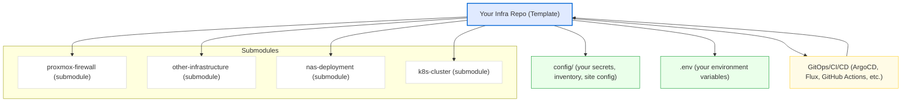

# Submodule Strategy: Using proxmox-firewall as a Vendor Submodule

## Overview

This repository is designed to be included as a **submodule** in a user's infrastructure or firewall project. The intent is **not** to use submodules within this repo, but to make it easy for users to:
- Add this repo as a submodule to their own project
- Keep all their configuration, secrets, and inventory in their own repo
- Use the code, tools, and scripts from this repo without modification
- Update the submodule independently of their configuration
- Avoid merge conflicts and config drift

## Recommended Project Structure

Suppose your project is called `my-firewall-project`. The recommended layout is:

```
my-firewall-project/
├── config/                # Your site-specific configuration, secrets, inventory, etc.
│   ├── sites/
│   ├── secrets/
│   └── ...
├── vendor/
│   ├── other-infrastructure/ #Other submodule with terraform, ansible, etc.
│   └── proxmox-firewall/  # This repo as a submodule
├── README.md
└── ...
```

- **Your repo** contains all configuration, secrets, and inventory.
- **This repo** (as a submodule) provides all automation, scripts, playbooks, and tools.
- **No user-specific config** should be added to the submodule.

---

## 📊 Submodule-Based GitOps Architecture



## Submodules for Config Isolation & GitOps

Using submodules for your infrastructure code enables strong separation of concerns and is a best practice for GitOps:

- **Config Isolation:** All your secrets, site-specific configuration, and inventory are kept in your parent repo, never in the submodule. This means you can safely update, replace, or even publicly share the submodule without risk of leaking sensitive data.
- **Composable Infrastructure:** You can add multiple submodules (firewall, NAS, K8s, VPN, etc.) to your parent repo, each providing automation for a different part of your stack. This makes your infrastructure modular and easy to extend.
- **GitOps-Ready:** The parent repo (with all config and submodules) is the single source of truth. You can use GitOps tools like ArgoCD, Flux, or GitHub Actions to automatically deploy, audit, and roll back infrastructure changes. All changes are tracked, reviewable, and auditable in git.
- **Safe Upgrades:** You can update submodules independently of your configuration, and pin them to specific versions/tags for stability.
- **Collaboration:** Teams can work on infrastructure code (submodules) and configuration (parent repo) independently, with clear boundaries and no risk of merge conflicts or config drift.

**In summary:**
- Your parent repo = your config, secrets, and GitOps pipeline
- Submodules = reusable, upgradable automation engines
- All changes are tracked and auditable in git, enabling true GitOps workflows

---

## Workflow

1. **Add the submodule**
   ```bash
   git submodule add https://github.com/FyberLabs/proxmox-firewall vendor/proxmox-firewall
   git submodule update --init --recursive
   ```
2. **Keep your config separate**
   - Store all secrets, site configs, and inventory in your own repo (e.g., `config/`)
   - Never add secrets to the submodule
3. **Use the tools/scripts**
   - Run scripts and playbooks from `vendor/proxmox-firewall`, passing in your config as needed
   - Example:
     ```bash
     vendor/proxmox-firewall/deployment/scripts/deploy.sh --config config/sites/my-site.yml
     ```
4. **Update the submodule**
   - To get new features or bugfixes:
     ```bash
     cd vendor/proxmox-firewall
     git fetch origin
     git checkout <new-release-tag>
     cd ../..
     git add vendor/proxmox-firewall
     git commit -m "Update proxmox-firewall submodule to <new-release-tag>"
     ```
5. **Security**
   - All secrets/config stay in your repo
   - The submodule is safe to update or replace at any time
   - No risk of leaking secrets by updating the submodule

## Best Practices

- **Never store secrets or config in the submodule**
- **Document your config structure** in your own repo
- **Pin the submodule** to a specific release/tag for stability
- **Update regularly** to get security and feature updates
- **Use PRs** to propose changes to the submodule (not to your config)

## Example: Updating the Submodule

```bash
cd vendor/proxmox-firewall
git fetch origin
git checkout v0.44.0  # or latest release
cd ../..
git add vendor/proxmox-firewall
git commit -m "Update proxmox-firewall submodule to v0.44.0"
```

## Why This Approach?

- **Separation of concerns**: Your config is yours; the code/tools are maintained upstream
- **Security**: No secrets ever leave your repo
- **Easy upgrades**: Get new features and fixes by updating the submodule
- **Collaboration**: Contribute improvements to the tools without risking your config

---

For questions or suggestions, open an issue or discussion in the [proxmox-firewall repo](https://github.com/FyberLabs/proxmox-firewall).

> **See also:**
> - [Main README: Using as a Submodule](../README.md#-using-as-a-submodule-recommended-for-integrators)
> - [proxmox-firewall-template](https://github.com/FyberLabs/proxmox-firewall-template) (starter repo for new projects) 